# vue-fun example

This example shows how to use bundler-in-browser with Vue.

```mermaid
flowchart LR
    subgraph Runtime
      direction TB
      LowCodeEdit["low-code edit"]
      Host["Component Host"]
    end

    subgraph "Editor"
      FS["fs (User Code)"]
      ErrorCollect["Error Collector"]
      CodeEditor["Code Editor"]
      Volar["Language Service"]
      Bundler["📦 bundler-in-browser"]

      FS <--> CodeEditor
      FS --> Volar
      FS --> Bundler
      Volar --> CodeEditor

      Bundler --> ErrorCollect
    end

    Bundler --> Runtime
    Runtime --> ErrorCollect

    Volar -.- LowCodeEdit
    LowCodeEdit --> FS

    subgraph "AI"
      CopilotChat["Copilot Chat"]
    end

    FS <--> AI
    ErrorCollect --> AI
```

## tech details

### compile and run

#### run `BuiltChunk` with `BuiltChunkManager`

in this experiment, bundler-in-browser makes `BuiltChunk`s:

- "user": the user component `export default Main`
- "vendor": the vendor modules `export const deps = { zod: ()=>..., "@vinejs/vine": ()=>..., ... }`

each `BuiltChunk` contains cjs and css result. the built chunks will be sent to previewer via `RuntimeConnection`, and then executed there.

user may rebuild many times. new chunk is handled by [`BuiltChunkManager`](./src/preview-runtime/runtime-handler.ts).
it reloads style and script tags, and notify the [ComponentHost](./src/preview-runtime/ComponentHost.vue)

esbuild output cjs by default, which relies on global volatile variable `require` and `module`. to fix them, the built code will be wrapped as a **factory function** within `window.__runBuiltChunk(name, function (require, module, exports) { ... })`.

> why squeeze the prelude into single line? because it will remain sourcemap reusable without modification! only first line of bundled code is affected, and in most cases user code remain safe.

#### dependencies

the mechanism is kinda different from regular AMD like requirejs. in the chunks, a [forged `fakeRequire()`](./src/preview-runtime/runtime-handler.ts) is used as the `require` in factory functions.

the `fakeRequire()` may take dependency modules from

2. platform built-in modules like `vue`
3. reusing imported modules for Vue HMR (see [./src/abilities/shabby-vue-hmr/README.md](./src/abilities/shabby-vue-hmr/README.md))
1. "vendor" chunk

as mentioned before, "vendor" chunk may update too, so we can't use `requirejs` which can't overwrite existing module with same id. however, in this app, when vendor chunk changes, the user chunk must be modified and will be reloaded, so it's safe to overwrite.

### vue hmr

see [./src/abilities/shabby-vue-hmr/README.md](./src/abilities/shabby-vue-hmr/README.md)

### dom to source mapping (vue-inspector)

basically borrowed idea and impl from [vue-inspector](https://github.com/webfansplz/vite-plugin-vue-inspector/blob/main/packages/core/src/compiler/template.ts)

- when bundler-in-browser compiles `<template>` of vue sfc:

  1. use `nodeTransforms` to inject attributes to each node.
  2. use `patchTemplateCompileResults` to patch `createElementVNode` and other functions, to hide attributes from DOM.
  3. in runtime, use `getInspectorDataFromElement(el)` to retrieve the data of HTMLElement, including source location and whether is component's root nodes (direct child of `<template>`)

- when bundler-in-browser compiles `<script>` of vue sfc:

  1. (TODO: support JSX syntax)

### store of editor

