# vue-fun example

This example shows how to use bundler-in-browser with Vue.

```mermaid
flowchart LR
    subgraph Runtime
      direction TB
      LowCodeEdit["low-code edit"]
      Host["Component Host"]
    end

    subgraph "Editor"
      FS["fs (User Code)"]
      ErrorCollect["Error Collector"]
      CodeEditor["Code Editor"]
      Volar["Language Service"]
      Bundler["📦 bundler-in-browser"]

      FS <--> CodeEditor
      FS --> Volar
      FS --> Bundler
      Volar --> CodeEditor

      Bundler --> ErrorCollect
    end

    Bundler --> Runtime
    Runtime --> ErrorCollect

    Volar -.- LowCodeEdit
    LowCodeEdit --> FS

    subgraph "AI"
      CopilotChat["Copilot Chat"]
    end

    FS <--> AI
    ErrorCollect --> AI
```

## tech details

### run in runtime

the runtime accept `BuiltChunk`s:

- "user": the user component `export default Main`
- "vendor": the vendor modules `export default { deps: { zod: ()=>..., "@vinejs/vine": ()=>..., ... } }`

#### run `BuiltChunk` with `BuiltChunkManager`

a `BuiltChunk` may update (eg. user updated the code), hence i made a `BuiltChunkManager` to load and update them in [preview-runtime/runtime-handler.ts](./src/preview-runtime/runtime-handler.ts)

esbuild output cjs by default, which relies on global volatile `require` and `module`. to fix them, the built code will be wrapped within `window.__updateBuiltinChunk(name, function (require, module, exports) {`

> why squeeze the prelude into single line? because it will remain sourcemap reusable without modification! only first line of bundled code is affected, and in most cases user code remain safe.

the mechanism is kinda different from regular AMD like requirejs. in the "user" chunk, `require()` shall pull dep modules from "vendor" chunk, or platform built-in modules like `vue`. and that's why you can find a `fakeRequire` in [preview-runtime/runtime-handler.ts](./src/preview-runtime/runtime-handler.ts)

there is no remote loading, so I simply made a shabby `define` function, rather than use completed `requirejs`. 

> actually it's because requirejs cannot overwrite existing module with same id. in this app, when vendor chunk change, the user chunk must be modified too, so it's not a problem.

1. get chunk js, css, marking the `BuiltChunkMounter` as updating, with a new Promise `updatingPromise`
2. update chunk HTMLScriptElement and HTMLStyleElement
3. the script will execute and call `window.__updateBuiltinChunk(name, factory)`
4. (if not vendor chunk), wait for vendor's updatingPromise
5. invoke factory, then resolve chunk's `updatingPromise` with the exports. the promise is retrieved from `currentScript[$updatingPromise]`
6. once promise resolved, all dependents will be notified, like the component host.

### store of editor

